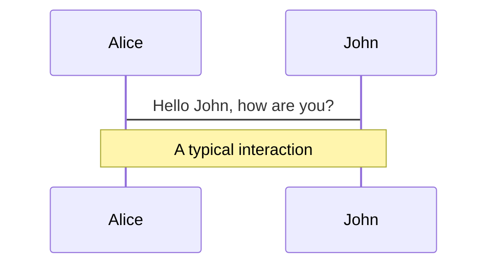
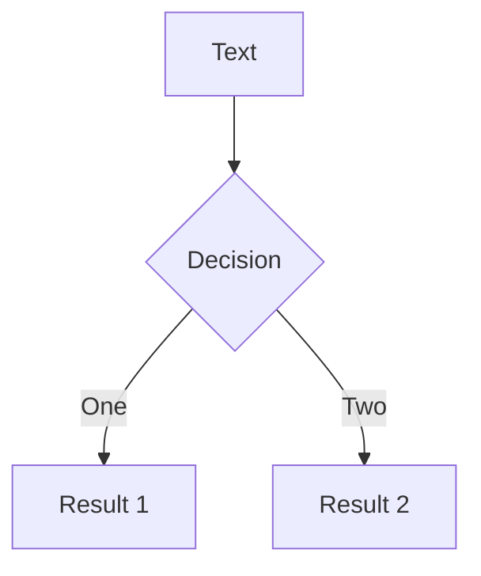
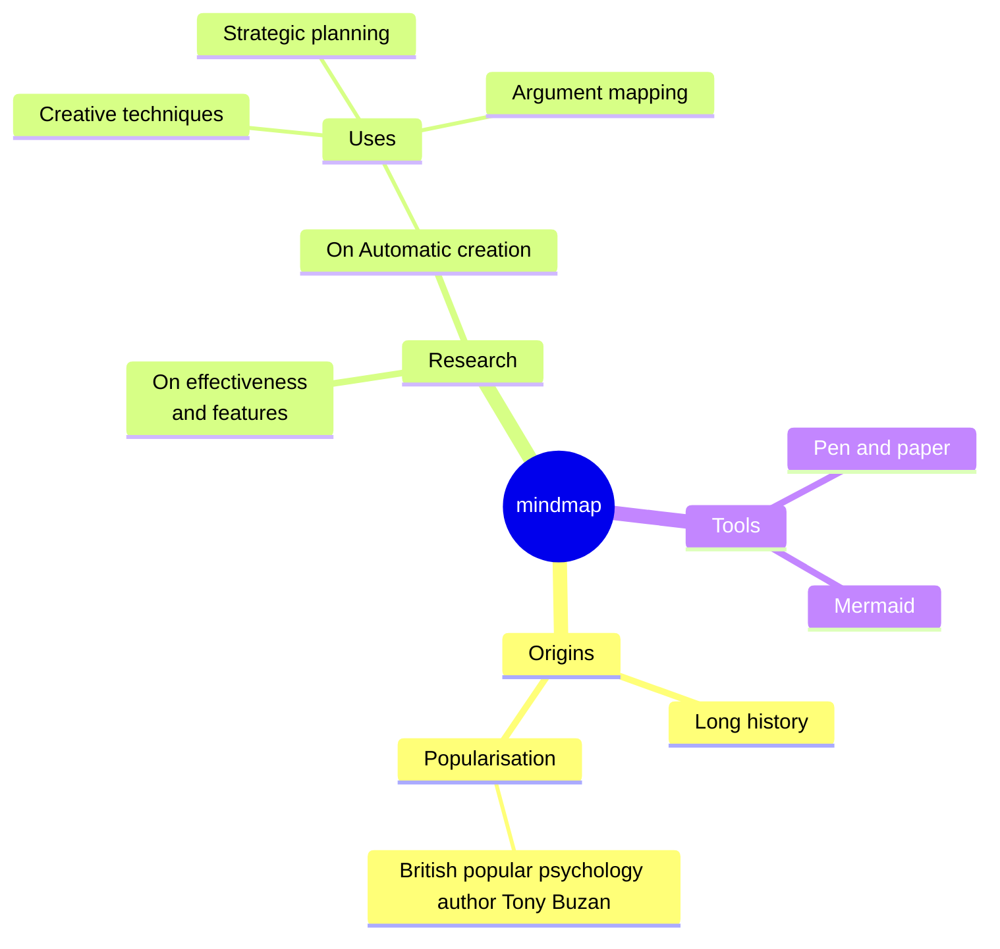
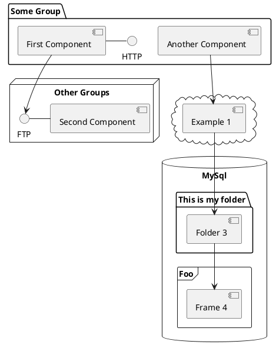

---
# try also 'default' to start simple
theme: ../../packages/theme-company
# random image from a curated Unsplash collection by Anthony
# like them? see https://unsplash.com/collections/94734566/slidev
background: https://cover.sli.dev
# some information about your slides (markdown enabled)
title: Üdvözöljük a Slidev-ben
info: |
  ## Slidev kezdő sablon
  Prezentációs diák fejlesztőknek.

  Tudj meg többet: [Sli.dev](https://sli.dev)
# apply UnoCSS classes to the current slide
class: text-center
# https://sli.dev/features/drawing
drawings:
  persist: false
# slide transition: https://sli.dev/guide/animations.html#slide-transitions
transition: slide-left
# enable Comark Syntax: https://comark.dev/syntax/markdown
comark: true
# duration of the presentation
duration: 35min
---

# Üdvözöljük a Slidev-ben

Prezentációs diák fejlesztőknek

<div @click="$slidev.nav.next" class="mt-12 py-1" hover:bg="white op-10">
  Nyomja a Szóközt a következő oldalhoz <carbon:arrow-right />
</div>

<div class="abs-br m-6 text-xl">
  <button @click="$slidev.nav.openInEditor()" title="Megnyitás szerkesztőben" class="slidev-icon-btn">
    <carbon:edit />
  </button>
  <a href="https://github.com/slidevjs/slidev" target="_blank" class="slidev-icon-btn">
    <carbon:logo-github />
  </a>
</div>

<!--
Az egyes diák utolsó megjegyzésblokkja dijegyzetként kezelődik. Előadói módban látható és szerkeszthető a diával együtt. [További információ a dokumentációban](https://sli.dev/guide/syntax.html#notes)
-->

---
transition: fade-out
---

# Mi a Slidev?

A Slidev fejlesztőknek készült diakészítő és előadóeszköz, az alábbi funkciókkal:

- 📝 **Szövegalapú** – a tartalomra fókuszálj Markdownban, a stílust később alakíthatod
- 🎨 **Témázható** – a témák megoszthatók és újrahasználhatók npm csomagként
- 🧑‍💻 **Fejlesztőbarát** – kódkiemelés, élő kódolás automatikus kiegészítéssel
- 🤹 **Interaktív** – Vue komponensek beágyazása a kifejezéshez
- 🎥 **Felvétel** – beépített rögzítés és kameranézet
- 📤 **Hordozható** – export PDF-be, PPTX-be, PNG-be, vagy akár hostolható SPA-ként
- 🛠 **Hackelhető** – ami egy weboldalon lehetséges, az a Slidev-ben is az
<br>
<br>

További információ: [Miért Slidev?](https://sli.dev/guide/why)

<!--
Markdownban használhatsz `style` taget az aktuális oldal stílusának felülírásához.
További információ: https://sli.dev/features/slide-scope-style
-->

<style>
h1 {
  background-color: #2B90B6;
  background-image: linear-gradient(45deg, #4EC5D4 10%, #146b8c 20%);
  background-size: 100%;
  -webkit-background-clip: text;
  -moz-background-clip: text;
  -webkit-text-fill-color: transparent;
  -moz-text-fill-color: transparent;
}
</style>

<!--
Itt egy másik megjegyzés.
-->

---
transition: slide-up
level: 2
---

# Navigáció

Vidd az egeret a bal alsó sarok fölé a navigációs vezérlőpanel megtekintéséhez, [további információ](https://sli.dev/guide/ui#navigation-bar)

## Billentyűparancsok

|                                                     |                                      |
| --------------------------------------------------- | ------------------------------------ |
| <kbd>right</kbd> / <kbd>space</kbd>                 | következő animáció vagy dia          |
| <kbd>left</kbd>  / <kbd>shift</kbd><kbd>space</kbd> | előző animáció vagy dia              |
| <kbd>up</kbd>                                       | előző dia                            |
| <kbd>down</kbd>                                     | következő dia                        |

<!-- https://sli.dev/guide/animations.html#click-animation -->

<p v-after class="absolute bottom-23 left-45 opacity-30 transform -rotate-10">Itt!</p>

---
layout: two-cols
layoutClass: gap-16
---

# Tartalomjegyzék

A `Toc` komponenssel tartalomjegyzéket generálhatsz a diáidhoz:

```html
<Toc minDepth="1" maxDepth="1" />
```

A cím a dia tartalmából következik, vagy felülírhatod a frontmatter `title` és `level` mezőivel.

::right::

<Toc text-sm minDepth="1" maxDepth="2" />

---
layout: image-right
image: https://cover.sli.dev
---

# Kód

Használj kódrészleteket közvetlen kiemeléssel, sőt típusok fölé is viheted az egeret!

```ts [filename-example.ts] {all|4|6|6-7|9|all} twoslash
// TwoSlash enables TypeScript hover information
// and errors in markdown code blocks
// More at https://shiki.style/packages/twoslash
import { computed, ref } from 'vue'

const count = ref(0)
const doubled = computed(() => count.value * 2)

doubled.value = 2
```

<arrow v-click="[4, 5]" x1="350" y1="310" x2="195" y2="342" color="#953" width="2" arrowSize="1" />

<!-- This allow you to embed external code blocks -->
<<< @/snippets/external.ts#snippet

<!-- Footer -->

[További információ](https://sli.dev/features/line-highlighting)

<!-- Inline style -->
<style>
.footnotes-sep {
  @apply mt-5 opacity-10;
}
.footnotes {
  @apply text-sm opacity-75;
}
.footnote-backref {
  display: none;
}
</style>

<!--
A megjegyzések szinkronban lehetnek a kattintásokkal

[click] Ez az első kattintás után lesz kiemelve

[click] Kiemelve: `count = ref(0)`

[click:3] Utolsó kattintás (két kattintás kihagyása)
-->

---
level: 2
---

# Shiki Magic Move

A [shiki-magic-move](https://shiki-magic-move.netlify.app/) támogatásával a Slidev animációkat támogat több kódrészlet között.

Adj meg több kódblokkot, és csomagold be őket <code>````md magic-move</code> (négy backtick) jelöléssel a magic move engedélyezéséhez. Példa:

````md magic-move {lines: true}
```ts {*|2|*}
// step 1
const author = reactive({
  name: 'John Doe',
  books: [
    'Vue 2 - Advanced Guide',
    'Vue 3 - Basic Guide',
    'Vue 4 - The Mystery'
  ]
})
```

```ts {*|1-2|3-4|3-4,8}
// step 2
export default {
  data() {
    return {
      author: {
        name: 'John Doe',
        books: [
          'Vue 2 - Advanced Guide',
          'Vue 3 - Basic Guide',
          'Vue 4 - The Mystery'
        ]
      }
    }
  }
}
```

```ts
// step 3
export default {
  data: () => ({
    author: {
      name: 'John Doe',
      books: [
        'Vue 2 - Advanced Guide',
        'Vue 3 - Basic Guide',
        'Vue 4 - The Mystery'
      ]
    }
  })
}
```

Non-code blocks are ignored.

```vue
<!-- step 4 -->
<script setup>
const author = {
  name: 'John Doe',
  books: [
    'Vue 2 - Advanced Guide',
    'Vue 3 - Basic Guide',
    'Vue 4 - The Mystery'
  ]
}
</script>
```
````

---

# Komponensek

<div grid="~ cols-2 gap-4">
<div>

Vue komponenseket közvetlenül használhatsz a diáidban.

Néhány beépített komponenst biztosítunk, mint a `<Tweet/>` és `<Youtube/>`, amelyeket azonnal használhatsz. Egyéni komponensek hozzáadása is egyszerű.

```html
<Counter :count="10" />
```

<!-- ./components/Counter.vue -->
<Counter :count="10" m="t-4" />

További információ: [útmutatók](https://sli.dev/builtin/components.html).

</div>
<div>

```html
<Tweet id="1390115482657726468" />
```

<Tweet id="1390115482657726468" scale="0.65" />

</div>
</div>

<!--
Előadói megjegyzés **félkövér**, *dőlt* és ~~áthúzott~~ szöveggel.

HTML elemek is érvényesek:
<div class="flex w-full">
  <span style="flex-grow: 1;">Bal oldali tartalom</span>
  <span>Jobb oldali tartalom</span>
</div>
-->

---
class: px-20
---

# Témák

A Slidev erőteljes támátámogatással érkezik. A témák stílusokat, elrendezéseket, komponenseket vagy akár eszközkonfigurációkat adhatnak. Témaváltás **egyetlen szerkesztéssel** a frontmatterben:

<div grid="~ cols-2 gap-2" m="t-2">

```yaml
---
theme: default
---
```

```yaml
---
theme: seriph
---
```


</div>

További információ: [Téma használata](https://sli.dev/guide/theme-addon#use-theme) és
nézd meg a [Awesome Themes galériát](https://sli.dev/resources/theme-gallery).

---

# Kattintásos animációk

`v-click` direktívával kattintásos animációt adhatsz elemekhez.

<div v-click>

Ez jelenik meg, amikor rákattintasz a diára:

```html
<div v-click>This shows up when you click the slide.</div>
```

</div>

<br>

<v-click>

A <span v-mark.red="3"><code>v-mark</code> direktíva</span>
lehetővé teszi
<span v-mark.circle.orange="4">inline jelöléseket</span>
is, a [Rough Notation](https://roughnotation.com/) alapján:

```html
<span v-mark.underline.orange>inline markers</span>
```

</v-click>

<div mt-20 v-click>

[További információ](https://sli.dev/guide/animations#click-animation)

</div>

---

# Mozgások

A mozgásanimációkat az [@vueuse/motion](https://motion.vueuse.org/) hajtja, a `v-motion` direktívával aktiválva.

```html
<div
  v-motion
  :initial="{ x: -80 }"
  :enter="{ x: 0 }"
  :click-3="{ x: 80 }"
  :leave="{ x: 1000 }"
>
  Slidev
</div>
```

<div class="w-60 relative">
  <div class="relative w-40 h-40">
    
    
    
  </div>

  <div
    class="text-5xl absolute top-14 left-40 text-[#2B90B6] -z-1"
    v-motion
    :initial="{ x: -80, opacity: 0}"
    :enter="{ x: 0, opacity: 1, transition: { delay: 2000, duration: 1000 } }">
    Slidev
  </div>
</div>

<!-- vue script setup scripts can be directly used in markdown, and will only affects current page -->
<script setup lang="ts">
const final = {
  x: 0,
  y: 0,
  rotate: 0,
  scale: 1,
  transition: {
    type: 'spring',
    damping: 10,
    stiffness: 20,
    mass: 2
  }
}
</script>

<div
  v-motion
  :initial="{ x:35, y: 30, opacity: 0}"
  :enter="{ y: 0, opacity: 1, transition: { delay: 3500 } }">

[További információ](https://sli.dev/guide/animations.html#motion)

</div>

---

# $\LaTeX$

A $\LaTeX$ támogatott alapból. Motor: [$\KaTeX$](https://katex.org/).

<div h-3 />

Inline $\sqrt{3x-1}+(1+x)^2$

Block
$$ {1|3|all}
\begin{aligned}
\nabla \cdot \vec{E} &= \frac{\rho}{\varepsilon_0} \\
\nabla \cdot \vec{B} &= 0 \\
\nabla \times \vec{E} &= -\frac{\partial\vec{B}}{\partial t} \\
\nabla \times \vec{B} &= \mu_0\vec{J} + \mu_0\varepsilon_0\frac{\partial\vec{E}}{\partial t}
\end{aligned}
$$

[További információ](https://sli.dev/features/latex)

---

# Diagramok

Diagramokat és gráfokat hozhatsz létre szöveges leírásból, közvetlenül a Markdownban.

<div class="grid grid-cols-4 gap-5 pt-4 -mb-6">









</div>

További információ: [Mermaid diagramok](https://sli.dev/features/mermaid) és [PlantUML diagramok](https://sli.dev/features/plantuml)

---
foo: bar
dragPos:
  square: 691,32,167,_,-16
---

# Húzható elemek

Dupla kattintással szerkesztheted a húzható elemek pozícióját.

<br>

###### Direktíva használata

```md

```

<br>

###### Komponens használata

```md
<v-drag text-3xl>
  <div class="i-carbon:arrow-up" />
  Use the `v-drag` component to have a draggable container!
</v-drag>
```

<v-drag pos="663,206,261,_,-15">
  <div text-center text-3xl border border-main rounded>
    Dupla kattintás!
  </div>
</v-drag>


###### Húzható nyíl

```md
<v-drag-arrow two-way />
```

<v-drag-arrow pos="70,452,253,46" two-way op70 />

---
src: ./pages/imported-slides.md
hide: false
---

---

# Monaco szerkesztő

A Slidev beépített Monaco szerkesztőt biztosít.

Add hozzá a `{monaco}` jelölést a kódblokkhoz, hogy szerkesztővé váljon:

```ts {monaco}
import { ref } from 'vue'
import { emptyArray } from './external'

const arr = ref(emptyArray(10))
```

A `{monaco-run}` futtatható szerkesztőt hoz létre, amely közvetlenül a dián futtathatja a kódot:

```ts {monaco-run}
import { version } from 'vue'
import { emptyArray, sayHello } from './external'

sayHello()
console.log(`vue ${version}`)
console.log(emptyArray<number>(10).reduce(fib => [...fib, fib.at(-1)! + fib.at(-2)!], [1, 1]))
```

---
layout: center
class: text-center
---

# További információ

[Dokumentáció](https://sli.dev) · [GitHub](https://github.com/slidevjs/slidev) · [Bemutatók](https://sli.dev/resources/showcases)

<PoweredBySlidev mt-10 />
